# Intertwined
__Draw intertwined threads, knots and knitting figures with PyCairo__
 
__Overall Idea__

Threads (paths) are made of segments (Bezier curves) with their own z-depth.

Segments are drawn in z-depth order, so that threads look Intertwined.

Control points are either set explicitely by the caller, or computed according to specific rules.

Here are the drawing steps, starting from lowest z-depth, here for `Braid.py`.

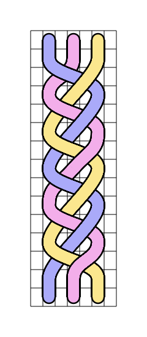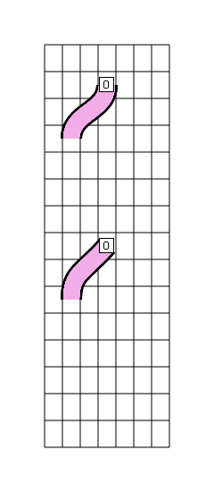

__Architecture__

There are three classes, stacked in a layer model.
 
    Canvas - the surface where to draw
    Thread - a specific thread, attached to a canvas
    Segment - a portion of a thread, with its own z-depth

__API__

The caller only interacts with Canvas, which exposes methods to create and move threads.

    cv = Canvas(...)
    t = cv.create_thread(...)
    cv.arc_to(t, ...)
    cv.arc_rel(t, ...)
    cv.draw(...)
  
Whenever a thread is moved, a segment is added to the thread.

Segments are [cubic Bezier curves](https://math.hws.edu/eck/cs424/notes2013/canvas/bezier.html), defined by two endpoints and two control points.

__Control points logic__
 
When not set by the caller, control points are calculated as follows:
 
* `cp1`: symetric to previous segment cp2 around segment origin
* `cp2`: from segment end towards segment cp1, same length as origin to cp1

<TABLE>

<TR>
    <TD>No control points are set explicitely on 1st segment s1.<BR />Control point s1.cp2 is computed as half s.p_s.o.<BR />Control point s2.cp1 (red) is computed according to previous segment s1.cp2 (green).<BR />Control point s2.cp2 is computed as s2.p_s2.cp1 with samed length as s2.cp1.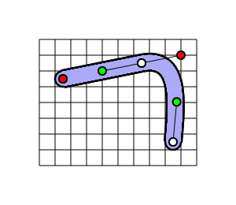</TD>
    <TD valign="top"><PRE>t = cv.create_thread(o = (1,2))
cv.arc_rel(t, 5, -1, 1)
cv.arc_rel(t, 2, 5, 1)</PRE></TD>
</TR>

<TR>
    <TD>s1.cp1 is set, s1.cp2 is calculated accordingly.<BR />Orientation propagates to s2.cp1.<BR />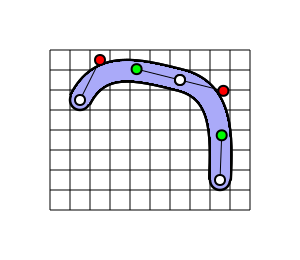</TD>
    <TD valign="top"><PRE>t = cv.create_thread(o = (1,2))
cv.arc_rel(t, 5, -1, 1, cp1=(1,-2))
cv.arc_rel(t, 2, 5, 1)
</PRE></TD>
</TR>

<TR>
    <TD>s1.cp2 is set, s2.cp1 is calculated accordingly.<BR />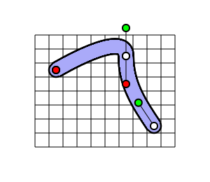</TD>
    <TD valign="top"><PRE>t = cv.create_thread(o = (1,2))
cv.arc_rel(t, 5, -1, 1, cp2=(0,-2))
cv.arc_rel(t, 2, 5, 1)</PRE></TD>
</TR>

<TR>
    <TD>Both control points are set for s1.<BR />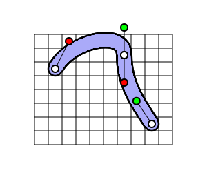</TD>
    <TD valign="top"><PRE>t = cv.create_thread(o = (1,2))
cv.arc_rel(t, 5, -1, 1, cp1=(1,-2), cp2=(0,-2))
cv.arc_rel(t, 2, 5, 1)</PRE></TD>
</TR>

</TABLE>

----

__Sample Drawings__

`Crochet.py`

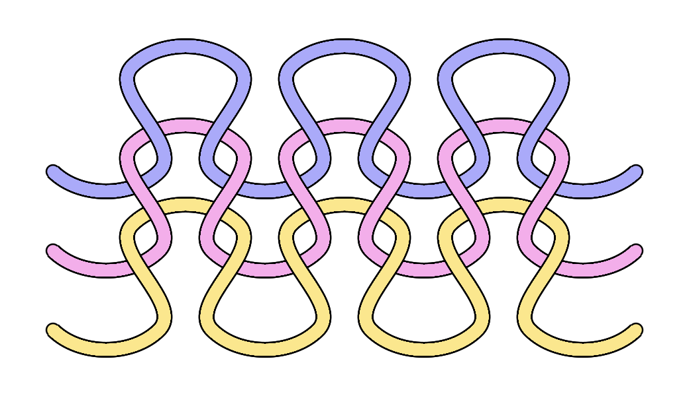

```Python
from Intertwined import *

cv = Canvas(47, 25)
        
v_offset = 6

for row in range(3):

    t = cv.create_thread(o = (1, 10 + (v_offset*row)))
    
    for col in range(3):

        cv.arc_rel(t,  8,  0, 1, cp1=(2, 2), cp2=(-2, 2))
        cv.arc_rel(t, -2, -8, 1, cp2=(-2, 2))
        cv.arc_rel(t,  8,  0, 0, cp2=(-2,-2))
        cv.arc_rel(t, -2,  8, 1, cp2=(-2,-2))
    
    cv.arc_rel(t,  8,  0, 1, cp2=(-2, 2))

cv.draw()

cv.surface.write_to_png("crochet.png")
```

----

`Knots.py`

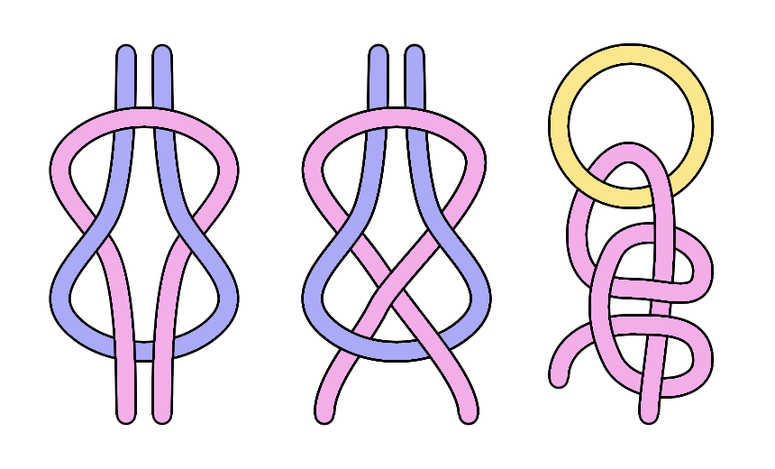

----

`Node.py`

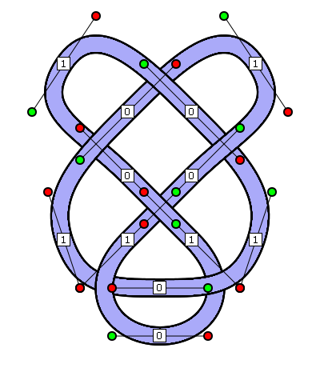

----

__Drawing Options__

<TABLE>

<TR>
    <TD>Draw Grid<BR />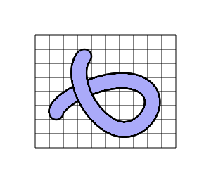</TD>
    <TD valign="top"><PRE>cv.draw(draw_grid=True)</PRE></TD>
</TR>

<TR>
    <TD>Stretch Grid<BR />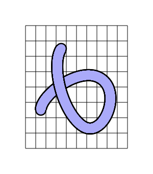</TD>
    <TD valign="top"><PRE>cv = Canvas(10, 8, col_size=20, row_size=30)</PRE></TD>
</TR>

<TR>
    <TD>Draw Points<BR />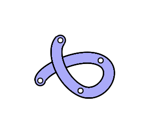</TD>
    <TD valign="top"><PRE>cv.draw(draw_points=True)</PRE></TD>
</TR>

<TR>
    <TD>Draw Control Points<BR />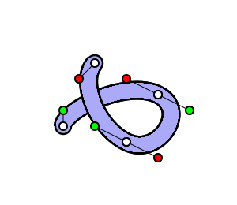</TD>
    <TD valign="top"><PRE>cv.draw(draw_cp=True)</PRE></TD>
</TR>

<TR>
    <TD>Draw Depth<BR />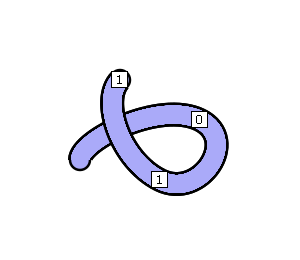</TD>
    <TD valign="top"><PRE>cv.draw(draw_depth=True)</PRE></TD>
</TR>

<TR>
    <TD>Draw All<BR />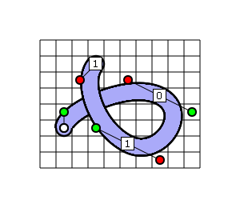</TD>
    <TD valign="top"><PRE>cv.draw(draw_grid=True,
    draw_points=True,
    draw_cp=True,
    draw_depth=True)
</PRE></TD>
</TR>

</TABLE>
